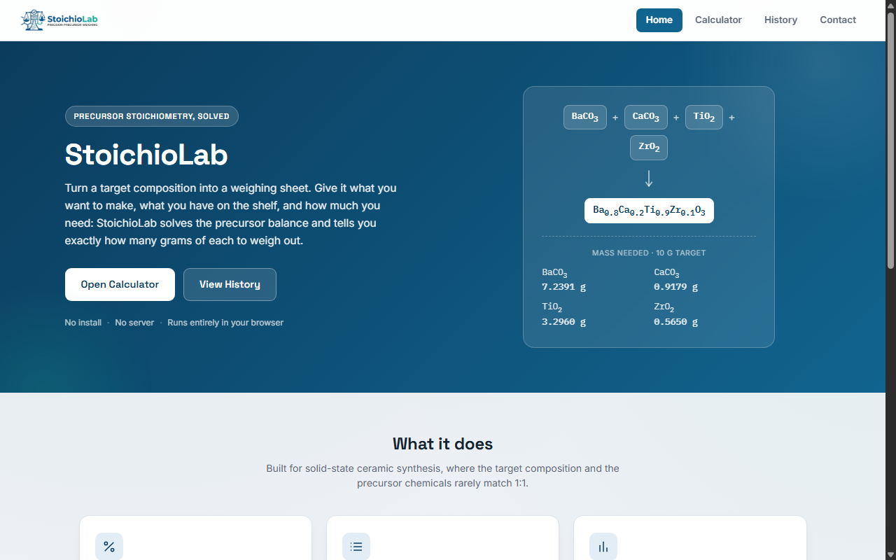

# StoichioLab

**Live: [slimeslab.github.io/StoichioLab](https://slimeslab.github.io/StoichioLab/)**

A precursor stoichiometry calculator for solid-state synthesis. Give it a target composition, the precursors you have on hand, and a total quantity, it tells you exactly how many grams of each to weigh out.

## Features

- Mol% or Wt% target composition input
- DO-NOT-balance rules for real decomposition chemistry (carbonates, nitrates, hydrates)
- Doping-series batch mode: solve several compositions in one pass
- Precursor autocomplete library
- Solve by target product mass or by total precursor mass, in mg or g
- CSV/print export, saveable and shareable recipes
- Literature-reference lookup for the same composition family
- Persistent calculation history

Originally ideated from [ChemSolve](https://occamy.chemistry.jhu.edu/chemsolve/index.php)'s core idea, extended with all of the above.

## Running locally

Plain HTML/CSS/JS, no build step, no dependencies. Clone the repo and serve it with any static server, e.g. `npx serve`, then open `http://localhost:<port>/`. Internal links use clean paths (`/calculator`, `/history`, `/contact`), which need a server to resolve, plain `file://` double-clicking won't route between pages correctly.

`node test_logic.js` runs a standalone regression suite against the core formula-parsing and balance-solving logic.

## License

MIT
